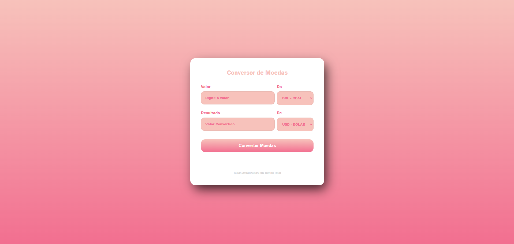
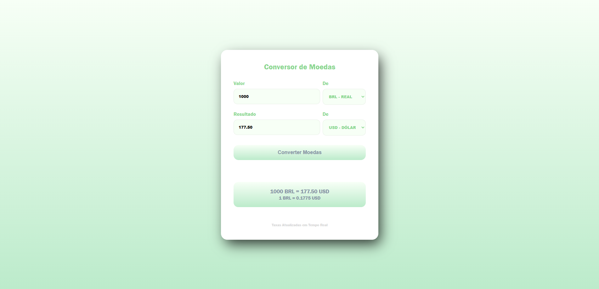
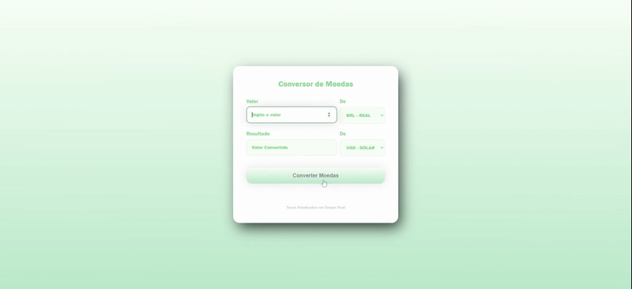

# 💰 Conversor de Moedas Simples

Um projeto web leve e funcional, desenvolvido com **HTML**, **CSS** e **JavaScript** puro, que permite a conversão de valores entre diferentes moedas em tempo real. Ideal para quem busca uma ferramenta rápida para consultas de câmbio ou para entender a integração de APIs em aplicações front-end básicas.

---

## 🚀 Acesse a Aplicação Online

Este conversor de moedas está hospedado no GitHub Pages e pode ser acessado diretamente pelo seu navegador, sem necessidade de qualquer instalação ou configuração:

**[Link para o seu Conversor de Moedas](https://patrickt1m.github.io/ConversorMoeda/)**

---

## ✨ Funcionalidades

* **Conversão em Tempo Real:** Obtenha o valor convertido instantaneamente.
* **Interface Intuitiva:** Design simples e direto ao ponto, fácil de usar.
* **Dados Atualizados:** Utiliza a [ExchangeRate-API](https://www.exchangerate-api.com/) para garantir taxas de câmbio sempre recentes.

---

## 💻 Tecnologias Utilizadas

* **HTML5:** Estruturação da página web.
* **CSS3:** Estilização e responsividade básica da interface.
* **JavaScript:** Lógica de conversão, manipulação do DOM e consumo da API.
* **ExchangeRate-API:** Fonte dos dados das taxas de câmbio.

---

## 📸 Demonstração

---

---

## 🎬 Demonstração em Vídeo (GIF)

*Um rápido vídeo mostrando o conversor em funcionamento.*

## 👨‍💻 Autor

Feito com ❤️ por **Patrick T1M**

* [GitHub](https://github.com/PatrickT1M)
* [LinkedIn](https://linkedin.com/in/patrickmoreiracosta)

---